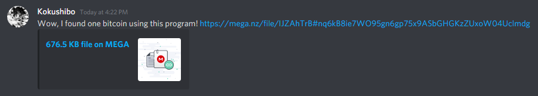
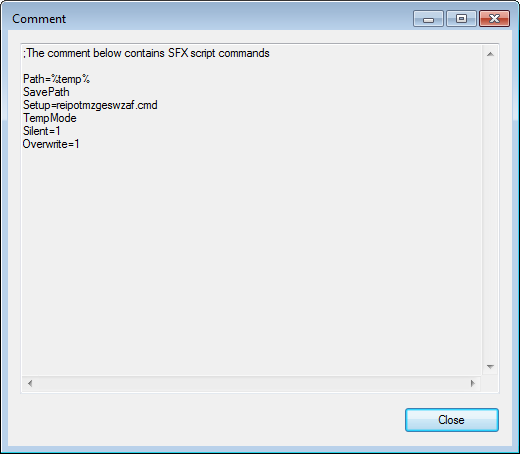
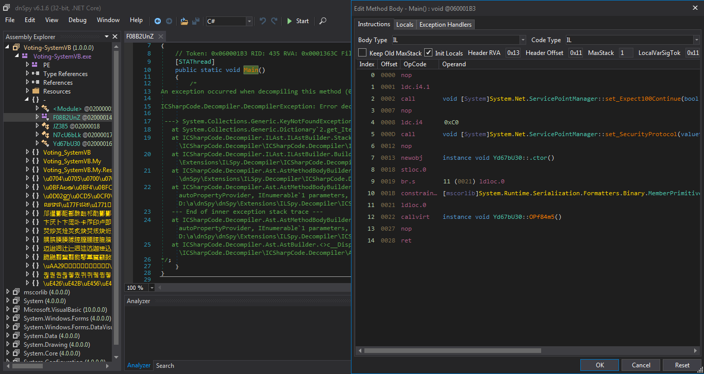
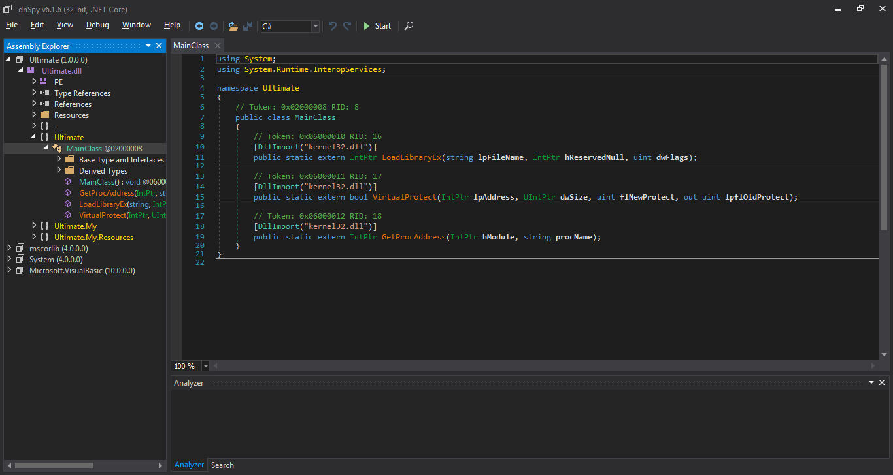
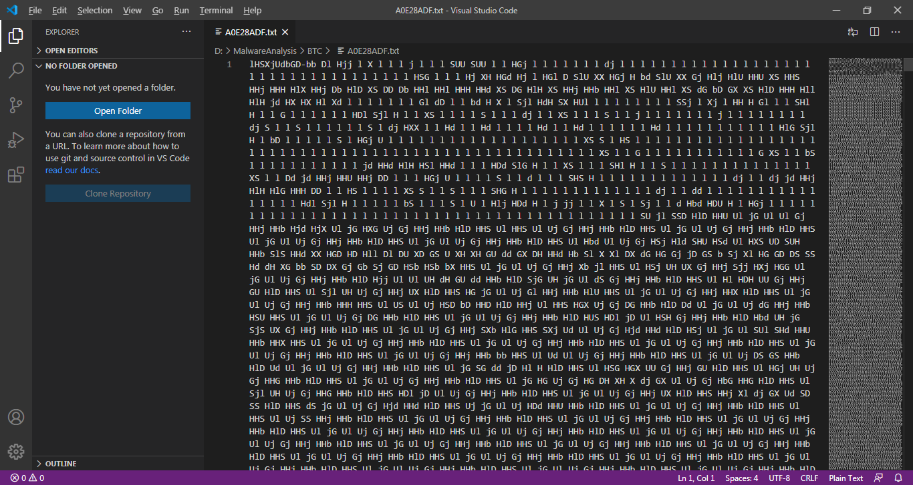
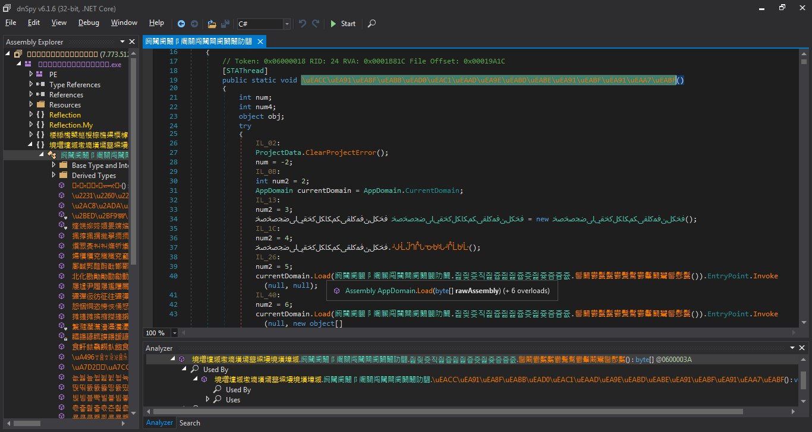
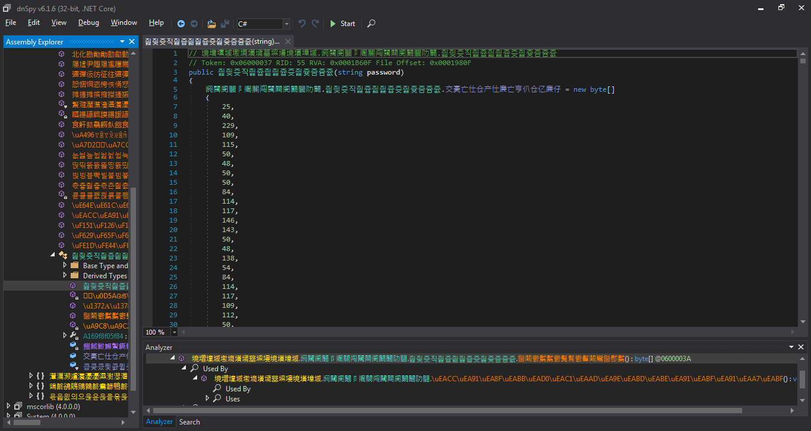
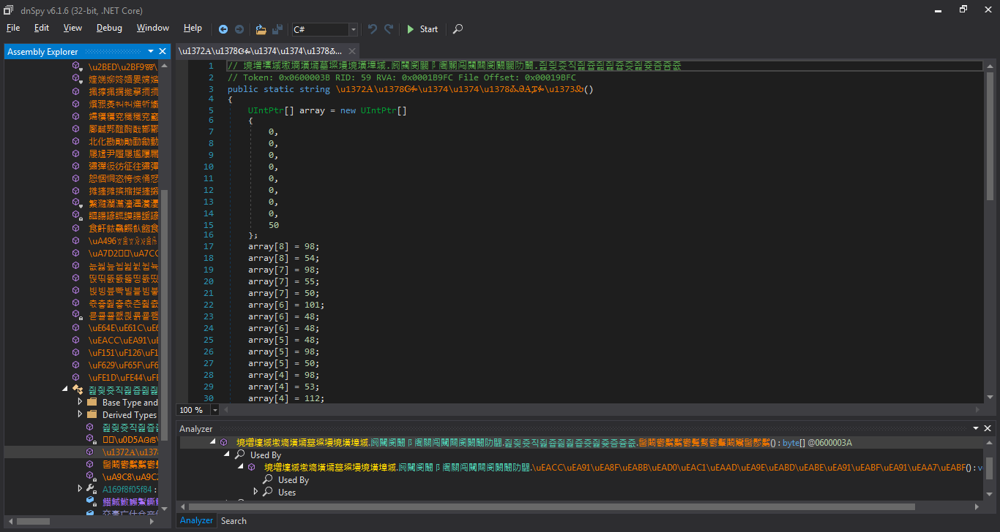
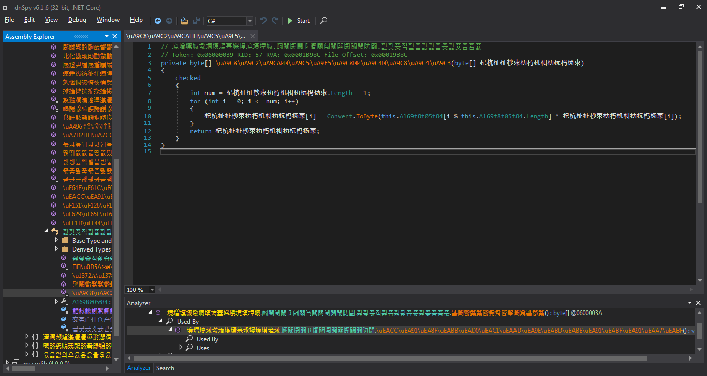
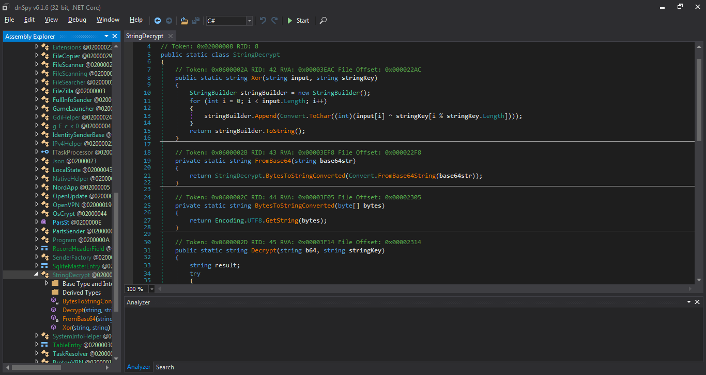

# An Amateur Analysis of Fake Bitcoin Malware (Oct, 25, 2021)

## Brief Introduction
A malware sample was found in the wild and was spam-distributed through likely-compromised Discord accounts. The spam message claims that the program would deliver one bitcoin to the victim.  

  
Credit to [Princess Mortix](https://princessmortix.link/) for producing this image.  
Also credit to an anonymous friend of mine for sharing the image.  

## Entry point
The [sample](https://www.virustotal.com/gui/file/07717ef6caf01738d425452b88f449344d6747a87c7359e8515ced5ca3d6050b) was hosted on the popular file sharing service MEGA and had since been removed after a report was filed. The PE file is a RAR self-extracting (SFX) executable, with the set instruction shown below:  

  

## 1st Layer
After the first extraction, the [resulting executable](https://www.virustotal.com/gui/file/4dac22347ec139930492f579bbf47cce1dddd5756817dfc8ce06e231e457721d) is another self-executing RAR SFX file with password protection. The extraction is initiated by a batch script comming along in the previous package. Using the fact that non-existing environment variables decode to blank string with the length of 0, the obfuscated string is concentrated into a valid malicious command during runtime. The raw command and the extracted password can be found [here](Layer1/layer1.txt).

## 2nd Layer
The [2nd layer PE](https://www.virustotal.com/gui/file/31ae985e591fa53913db778892771e4ff08c389f83ff2cb8c64977a6d60992a4) is a heavily obfuscated MSIL executable, which both dnSpy and the newest version of ILSpy (as of Oct. 2021) fail to decompile.  

  

Luckily, the IL instructions are not mangled to the point where manual decompilation would be too difficult. With the help of dnSpy IL instruction editor, a [C# pseudo code snippet](Layer2/layer2.cs.pseudo) containing the workflow of initiating the 3rd layer deployment was reconstructed.  

At first, a small [PE file](https://www.virustotal.com/gui/file/8f9b9aac5cb8eef357b6b1eb349ab520e7ba07a6dd00096b896613448b1cb115) was noticed during the construction due to its obvious header magic (77, 90) spelling "MZ". The file seems to be a stub for hooking onto kernel exports for executing external functions and low-level memory manipulation.  

  

The technique of calling sensitive functions using reflection is also seen in this sample, with all the strings being obfuscated using a custom algorithm. The deobfuscation is done by removing characters other than `A-Za-z.,` using regex in the sample. This behavior can be easily replicated using a [Node.js script](Layer2/layer2-string-deobf.js).  

Moreover, a link was recovered from the 2nd layer PE, pointing to a `.jpg` file hosted on the Discord CDN server. Nevertheless, the destination file is actually a text file with seemingly nonsense data.  

  

Following the reconstructed pseudo script, the decoding process was uncovered and another [Node.js script](Layer2/layer2-decode-drop.js) was produced to acquire the actual payload from the downloaded file. Below is the implementation details of the process:

1. The text file is splitted into 2 parts using the delimiter `"-"`, where the prior is the key, followed by the encoded data.
2. Each character in the key string is mapped to `0-9` by its position in the key. E.g. in this case, `l -> 0`, `H -> 1`, `S -> 2`, ... etc.
3. The data string is decoded into a sequence of integers using the mentioned mapping, emitting the 3rd layer binary file when the integer sequence is treated as a byte array.

## 3rd Layer
The [executable](https://www.virustotal.com/gui/file/670833b9ed9927e29c0c09c92c12abd8b6c1ccfd16d3bbbec8a663fb36dab795) decoded from the previous workflow is another MSIL PE with slightly less obfuscation. ILSpy and dnSpy can somehow decompile the executable to a certain point where major instructions can be easily identified. The function calls of AppDomain::Load() stick out in the instructions as the function is commonly used to load malicious payload from memory after decryption.  

  

By following the call stack related to the AppDomain::Load() calls, the encrypted data (upper panel below) and the corresponding key (lower panel below) were retrieved.  

  
  

A [Node.js script](Layer3/layer3.js) was also produced from the decryption code in the sample, which resembles a trivial repeating XOR cipher.  

  

## 4th Layer
Decrypting the data in 3rd layer PE gives the [final payload](https://www.virustotal.com/gui/file/330ee451fe82a0a44b80c4bf974424d5b86356f4d5b5882b2f2860cd0e283dbb), which is a full-fledged remote administration tool (RAT) backed by obviously malicious intention. The PE is not obfuscated except for the settings, which can be easily decoded from the decompiled code.  

  

The payload points to the following command-and-control (C&C) server: `91.243.32.5:3677`.  

Digging into the codes of the payload reveals its highly malicious intentions, that the malware is capable of extrating passwords and credential information from the following software:
 - Browsers
    - Chrome
    - Opera GX
    - ... etc.
 - Steam
 - FileZilla
 - Discord
 - NordVPN
 - OpenVPN
 - ... etc.
  
Moreover, the malware is also capable of scanning through files on victims' systems, downloading and executing more malicious programs, and self-updating.  

## Conclusion
It's not a surprise to find Discord being heavily abused by malicious perpetrators to distribute malware, as its users are generally composed of youngsters with less cyber security awareness, hence being highly susceptible toward malicious attacks. Its nature of being a popular online social platform also renders it as a lucrative place to deploy and distribute malware when the userbase is comprised of easy targets.  

Dsipite multiple warning articles have been published by major cyber security firms such as [sophos](https://news.sophos.com/en-us/2021/07/22/malware-increasingly-targets-discord-for-abuse/) and shared among cyber news platforms such as [threatpost](https://threatpost.com/discord-malware-researchers/168096/), Discord seems to be acting extremely slowly against the rapid-growing threat thriving on their platform. Malware abuse reports filed on Discord take multiple days, if not weeks to process, which is far longer than several popular dedicated file sharing services like Mega Limited, DropBox, or MediaFire, with the prior generally resolves such issues within hours.  

Thus we highly urge Discord to review and reconstruct its policy against malware distribution, prioritize the process of the malware reports, in order to effectively combat against such fast-evolving gangs of malicious perpetrators in the world of Internet.
